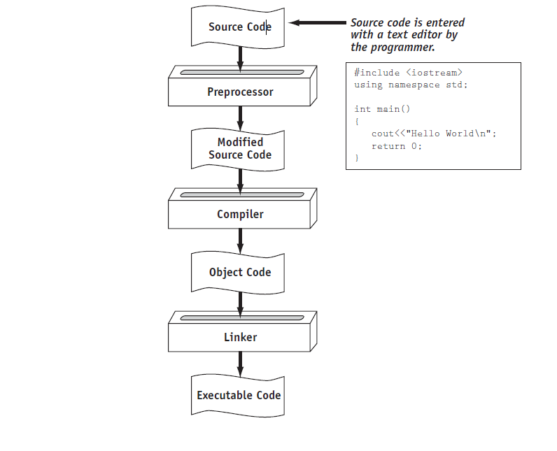
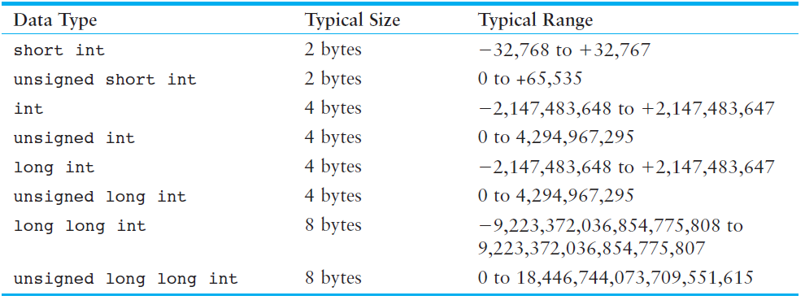

# Review Session for Section 1 - 6

## Correction and Clarification
- In Component 29 of Section 4, actually all the errors mentioned here are commonly referred to as Syntax errors. While semantic errors are usually used interchangebly with Logic errors (Section 4 Component 33)
- In Component 48 of Section 6, you don't need to use 
```cpp
#include <climits>
```
in order to use 

```cpp
sizeof()

```
function. ``` sizeof()``` function is a build-in function of C++. However, you need to include ```<climits>``` or ```<cfloat>``` if you want to have access to constants like INT_MIN, LONG_MAX	and so forth. 

Just want to clarify this since this section seemingly implies that you must include those external libraries in order to use ```sizeof()```, which is in fact not the case.

- Summary of the process of translating a C++ source file into an executable file 


- There is no ```;``` in the end when you use the preprocessor directive ```#include<>```.
## Review Questions

Q1. The following C++ program will not compile because the lines have been mixed up.
``` cpp
int main()
}
// A crazy mixed up program
return 0;
#include <iostream>
cout << "In 1492 Columbus sailed the ocean blue.";
{
using namespace std;
```

When the lines are properly arranged the program should display the following on the screen:
```
In 1492 Columbus sailed the ocean blue.
```
Rearrange the lines in the correct order. Test the program by entering it on the computer, compiling it, and running it.

Q2. The following C++ program will not compile because the lines have been mixed up.
``` cpp
cout << "Success\n";
cout << " Success\n\n";
int main()
cout << "Success";
}
using namespace std;
// It's a mad, mad program
#include <iostream>
cout << "Success\n";
{
return 0;
```
When the lines are properly arranged the program should display the following on the screen:
```
Success
Success Success

Success
```

Rearrange the lines in the correct order. Test the program by entering it on the computer, compiling it, and running it.

Q3. Study the following program and show what it will print on the screen.
``` cpp
// The Works of Wolfgang
#include <iostream>
using namespace std;
int main()
{
  cout << "The works of Wolfgang\ninclude the following";
  cout << "\nThe Turkish March" << endl;
  cout << "and Symphony No. 40 ";
  cout << "in G minor." << endl;
  return 0;
}
```

Q4. Examine the following program.
``` cpp
// This program uses variables and literals.
#include <iostream>
using namespace std;
int main()
{
  int little;
  int big;
  little = 2;
  big = 2000;
  cout << "The little number is " << little << endl;
  cout << "The big number is " << big << endl;
  return 0;
}
  ```
List all the variables and literals that appear in the program.
  
Q5. What will the following program display on the screen?
``` cpp
#include <iostream>
using namespace std;
int main()
{
  int number;
  number = 712;
  cout << "The value is " << "number" << endl;
  return 0;
}
```
Q6. Which of the following are illegal variable names, and why?
```cpp
X
99bottles
july97
theSalesFigureForFiscalYear98
r&d
grade_report
```

Here are some specific rules that must be followed with all identifiers.
- The first character must be one of the letters a through z, A through Z, or an underscore
character (_).
-  After the first character you may use the letters a through z or A through Z, the digits
0 through 9, or underscores.
- Uppercase and lowercase characters are distinct. This means `ItemsOrdered` is not the
same as `itemsordered`.

Q7. 
- If a variable needs to hold numbers in the range 32 to 6,000, what data type
would be best?
- If a variable needs to hold numbers in the range 40,000 to 40,000, what
data type would be best?
- Which of the following literals uses more memory? 20 or 20L


